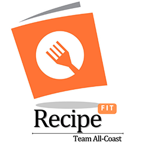
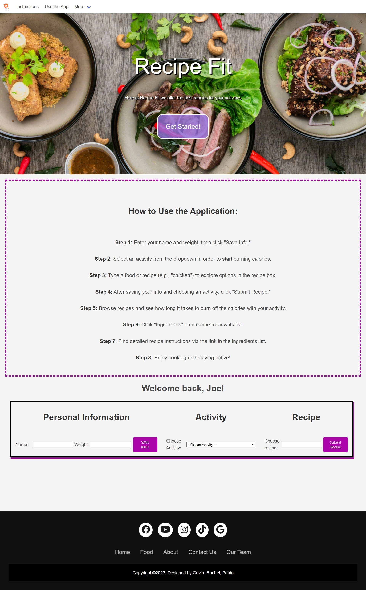

<!-- Improved compatibility of back to top link: See: https://github.com/othneildrew/Best-README-Template/pull/73 -->
<a name="readme-top"></a>
<!--
*** Thanks for checking out the Best-README-Template. If you have a suggestion
*** that would make this better, please fork the repo and create a pull request
*** or simply open an issue with the tag "enhancement".
*** Don't forget to give the project a star!
*** Thanks again! Now go create something AMAZING! :D
-->


<!-- PROJECT SHIELDS -->
<!--
*** I'm using markdown "reference style" links for readability.
*** Reference links are enclosed in brackets [ ] instead of parentheses ( ).
*** See the bottom of this document for the declaration of the reference variables
*** for contributors-url, forks-url, etc. This is an optional, concise syntax you may use.
*** https://www.markdownguide.org/basic-syntax/#reference-style-links
-->
[![Contributors][contributors-shield]][contributors-url]
[![Forks][forks-shield]][forks-url]
[![Stargazers][stars-shield]][stars-url]
[![Issues][issues-shield]][issues-url]
[![MIT License][license-shield]][license-url]


<!-- PROJECT LOGO -->
<br />
<div align="center">
  <a href="https://github.com/Project1Team1GPR/Recipe-Fit">
    
  </a>

<h3 align="center">Recipe Fit</h3>

  <p align="center">
    <br />
    <a href="https://github.com/Project1Team1GPR/Recipe-Fit"><strong>Explore the docs »</strong></a>
    <br />
    <br />
    <a href="https://github.com/Project1Team1GPR/Recipe-Fit">View Demo</a>
    ·
    <a href="https://github.com/Project1Team1GPR/Recipe-Fit/issues">Report Bug</a>
    ·
    <a href="https://github.com/Project1Team1GPR/Recipe-Fit/issues">Request Feature</a>
  </p>
</div>


<!-- TABLE OF CONTENTS -->
<details>
  <summary>Table of Contents</summary>
  <ol>
    <li>
      <a href="#about-the-project">About The Project</a>
      <ul>
        <li><a href="#built-with">Built With</a></li>
      </ul>
    </li>
    <li>
      <a href="#getting-started">Getting Started</a>
      <ul>
        <li><a href="#prerequisites">Prerequisites</a></li>
        <li><a href="#installation">Installation</a></li>
      </ul>
    </li>
    <li><a href="#usage">Usage</a></li>
    <li><a href="#roadmap">Roadmap</a></li>
    <li><a href="#contributing">Contributing</a></li>
    <li><a href="#license">License</a></li>
    <li><a href="#contact">Contact</a></li>
    <li><a href="#acknowledgments">Acknowledgments</a></li>
  </ol>
</details>


<!-- ABOUT THE PROJECT -->
## About The Project

[![Recipe Fit Deployed Link][product-screenshot]](https://project1team1gpr.github.io/Recipe-Fit/)

<!-- Here's a blank template to get started: To avoid retyping too much info. Do a search and replace with your text editor for the following: `Project1Team1GPR`, `Recipe-Fit`, `twitter_handle`, `linkedin_username`, `email_client`, `email`, `Recipe Fit`, `project_description` -->

Welcome to Recipe Fit, the all-in-one app that revolutionizes your journey to a healthier, fitter you! Whether you're a seasoned fitness enthusiast or just starting your wellness adventure, Explore an extensive recipe library, carefully curated to please your palate, and unlock personalized workout plans tailored just for you. Embark on a journey of wellness with Recipe Fit. Try it now and experience the perfect blend of fitness, nutrition, and community, all in one app! Your healthier, happier self is just a tap away.

Our application is a great resource to help you determine how long of a specific exercise you need to perform in order to burn off the total calories of your recipe of choice.

### User Story
As a health-conscious user,<br>
I want to be able to search for recipes that align with my specific nutritional requirements and informed how much activity is needed to burn off these calories,<br>
So that I can maintain my diet and health goals without extensive manual research.

### Screenshot


<p align="right">(<a href="#readme-top">back to top</a>)</p>


### Built With

<!-- * [![Next][Next.js]][Next-url]
* [![React][React.js]][React-url]
* [![Vue][Vue.js]][Vue-url]
* [![Angular][Angular.io]][Angular-url]
* [![Svelte][Svelte.dev]][Svelte-url]
* [![Laravel][Laravel.com]][Laravel-url] -->
<!-- * [![Bootstrap][Bootstrap.com]][Bootstrap-url]
* [![JQuery][JQuery.com]][JQuery-url]
* [![BULMA][bulma.io]][BULMA-url] -->
- JavaScript
- JQuery
- BULMA

<p align="right">(<a href="#readme-top">back to top</a>)</p>


<!-- GETTING STARTED -->
<!-- ## Getting Started

This is an example of how you may give instructions on setting up your project locally.
To get a local copy up and running follow these simple example steps.

### Prerequisites

This is an example of how to list things you need to use the software and how to install them.
* npm
  ```sh
  npm install npm@latest -g
  ```

### Installation

1. Get a free API Key at [https://example.com](https://example.com)
2. Clone the repo
   ```sh
   git clone https://github.com/Project1Team1GPR/Recipe-Fit.git
   ```
3. Install NPM packages
   ```sh
   npm install
   ```
4. Enter your API in `config.js`
   ```js
   const API_KEY = 'ENTER YOUR API';
   ```

<p align="right">(<a href="#readme-top">back to top</a>)</p>  -->


<!-- USAGE EXAMPLES -->
## Usage

Use this space to show useful examples of how a project can be used. Additional screenshots, code examples and demos work well in this space. You may also link to more resources.

_For more examples, please refer to the [Documentation](https://example.com)_

<p align="right">(<a href="#readme-top">back to top</a>)</p>


<!-- ROADMAP -->
<!-- ## Roadmap

- [ ] Feature 1
- [ ] Feature 2
- [ ] Feature 3
    - [ ] Nested Feature

See the [open issues](https://github.com/Project1Team1GPR/Recipe-Fit/issues) for a full list of proposed features (and known issues).

<p align="right">(<a href="#readme-top">back to top</a>)</p> -->


<!-- CONTRIBUTING -->
## Contributing

Contributions are what make the open source community such an amazing place to learn, inspire, and create. Any contributions you make are **greatly appreciated**.

If you have a suggestion that would make this better, please fork the repo and create a pull request. You can also simply open an issue with the tag "enhancement".
Don't forget to give the project a star! Thanks again!

1. Fork the Project
2. Create your Feature Branch (`git checkout -b feature/AmazingFeature`)
3. Commit your Changes (`git commit -m 'Add some AmazingFeature'`)
4. Push to the Branch (`git push origin feature/AmazingFeature`)
5. Open a Pull Request

<p align="right">(<a href="#readme-top">back to top</a>)</p>


<!-- LICENSE -->
<!-- ## License

Distributed under the MIT License. See `LICENSE.txt` for more information.

<p align="right">(<a href="#readme-top">back to top</a>)</p> -->


<!-- CONTACT -->
## Contributors' Contact Information

Gavin Meyer - gpmeyer24@gmail.com - GitHub: gmeyer24

Rachel V - yesrjv@gmail.com - GitHub: 1122c

Patric Xiong - pathlub@gmail.com - GitHub: PatricXiong 

Deployed Project Link: [https://project1team1gpr.github.io/Recipe-Fit/](https://project1team1gpr.github.io/Recipe-Fit/)

GitHub Project Link: [https://github.com/Project1Team1GPR/Recipe-Fit](https://github.com/Project1Team1GPR/Recipe-Fit)

<p align="right">(<a href="#readme-top">back to top</a>)</p>


<!-- ACKNOWLEDGMENTS -->
## Acknowledgments

* [Othneil Drew's README Example](https://github.com/othneildrew/Best-README-Template#best-readme-template)
* [Vincent Teune's README Example](https://github.com/cobalt88/CPS-API)
* [Make a README](https://www.makeareadme.com/)
* [W3Schools](https://www.w3schools.com/)
* Carlin Shaw - Tutor
* ChatGPT 
* Rich Hosek & Vince Teune - Instructor & TA

<p align="right">(<a href="#readme-top">back to top</a>)</p>


<!-- MARKDOWN LINKS & IMAGES -->
<!-- https://www.markdownguide.org/basic-syntax/#reference-style-links -->
[contributors-shield]: https://img.shields.io/github/contributors/Project1Team1GPR/Recipe-Fit.svg?style=for-the-badge
[contributors-url]: https://github.com/Project1Team1GPR/Recipe-Fit/graphs/contributors
[forks-shield]: https://img.shields.io/github/forks/Project1Team1GPR/Recipe-Fit.svg?style=for-the-badge
[forks-url]: https://github.com/Project1Team1GPR/Recipe-Fit/network/members
[stars-shield]: https://img.shields.io/github/stars/Project1Team1GPR/Recipe-Fit.svg?style=for-the-badge
[stars-url]: https://github.com/Project1Team1GPR/Recipe-Fit/stargazers
[issues-shield]: https://img.shields.io/github/issues/Project1Team1GPR/Recipe-Fit.svg?style=for-the-badge
[issues-url]: https://github.com/Project1Team1GPR/Recipe-Fit/issues
[license-shield]: https://img.shields.io/github/license/Project1Team1GPR/Recipe-Fit.svg?style=for-the-badge
[license-url]: https://github.com/Project1Team1GPR/Recipe-Fit/blob/master/LICENSE.txt
[linkedin-shield]: https://img.shields.io/badge/-LinkedIn-black.svg?style=for-the-badge&logo=linkedin&colorB=555
[linkedin-url]: https://linkedin.com/in/linkedin_username
[product-screenshot]: images/screenshot.png
[Next.js]: https://img.shields.io/badge/next.js-000000?style=for-the-badge&logo=nextdotjs&logoColor=white
[Next-url]: https://nextjs.org/
[React.js]: https://img.shields.io/badge/React-20232A?style=for-the-badge&logo=react&logoColor=61DAFB
[React-url]: https://reactjs.org/
[Vue.js]: https://img.shields.io/badge/Vue.js-35495E?style=for-the-badge&logo=vuedotjs&logoColor=4FC08D
[Vue-url]: https://vuejs.org/
[Angular.io]: https://img.shields.io/badge/Angular-DD0031?style=for-the-badge&logo=angular&logoColor=white
[Angular-url]: https://angular.io/
[Svelte.dev]: https://img.shields.io/badge/Svelte-4A4A55?style=for-the-badge&logo=svelte&logoColor=FF3E00
[Svelte-url]: https://svelte.dev/
[Laravel.com]: https://img.shields.io/badge/Laravel-FF2D20?style=for-the-badge&logo=laravel&logoColor=white
[Laravel-url]: https://laravel.com
[Bootstrap.com]: https://img.shields.io/badge/Bootstrap-563D7C?style=for-the-badge&logo=bootstrap&logoColor=white
[Bootstrap-url]: https://getbootstrap.com
[JQuery.com]: https://img.shields.io/badge/jQuery-0769AD?style=for-the-badge&logo=jquery&logoColor=white
[JQuery-url]: https://jquery.com 
[bulma.io]: https://img.shields.bulma.io/badge/
[BULMA-url]: https://bulma.io/ 
